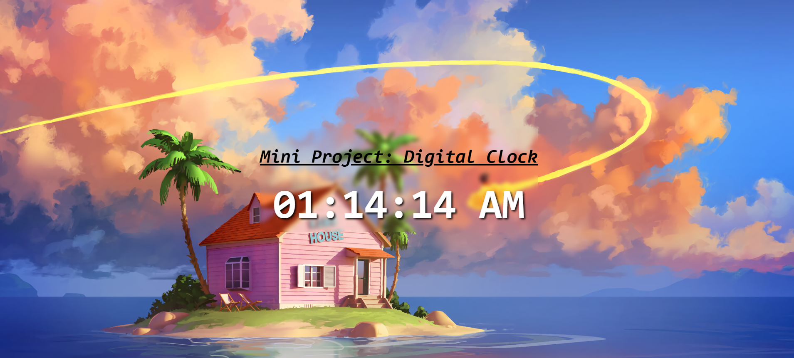

## 🕰️ Digital Clock Project:

- A digital clock that displays the current time dynamically with a visually appealing background inspired by Dragon Ball. This was a learning project used for practicing useEffect hooks.

## 😧 Features:
- ⏰ Live Time Updates: The clock updates every second.
- 🎨 Aesthetic Background: A visually stunning design for a more immersive experience.
- 🌙 AM/PM Format: Displays time in 12-hour format.

##  📸 Screenshot: 
- 

##  🌍 LIVE DEMO:
- Try it Out: https://chrisw0987.github.io/digital-clock/

## 🛠 Tech Stack:
- **Frontend:** React.js, Vite
- **Styling:** CSS, Animations
- **Tools**: GitHub, VS Code


## 📦 Installation:
1. Clone the repository:
   ```bash
   git clone https://chrisw0987.github.io/digital-clock/
2. cd digital-clock
3. npm install
4. npm run dev
